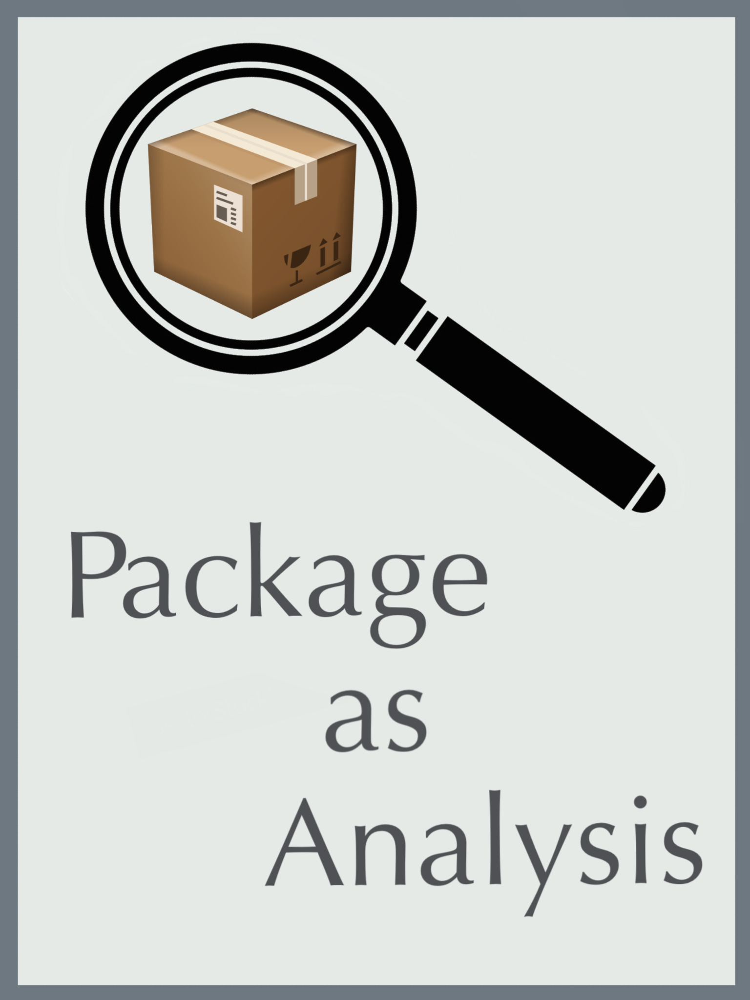

# Package as Analysis 

[This book is currently in progress, though any feedback is welcome.]

This is a manual on how to use the standard R package framework for data analysis. Though potentially more work, especially at the start, the purpose of using the R package framework is to maintain a clear and reproducible analysis. 

Read the full book [here](https://jhrcook.github.io/package-as-analysis)

[I will post a link to an example here, though I am waiting for the full paper to publish before doing so for IP issues.]

## Advantages

There are many advantages to using this framework. Here are just a few, though I am sure you will find there are many others:

* Because this is a standard framework, other will be able to navigate the directories and files adeptly.
* The implementation of tests on functions and subroutines will make bugs easier to find and increase overall confidence in the validity of the analysis
* This is a seamless mixture of scripts and markdown files for the separation of functions and analysis
* Complete documentation of functions makes returning to code later much easier!
* The analysis can take advantage of normal R package tools such as [Travis-CL](https://travis-ci.org) and [Codecov](https://codecov.io) integration, [pkgdown](https://pkgdown.r-lib.org), and [devtools](https://devtools.r-lib.org) (build checks, documentation, etc.).

